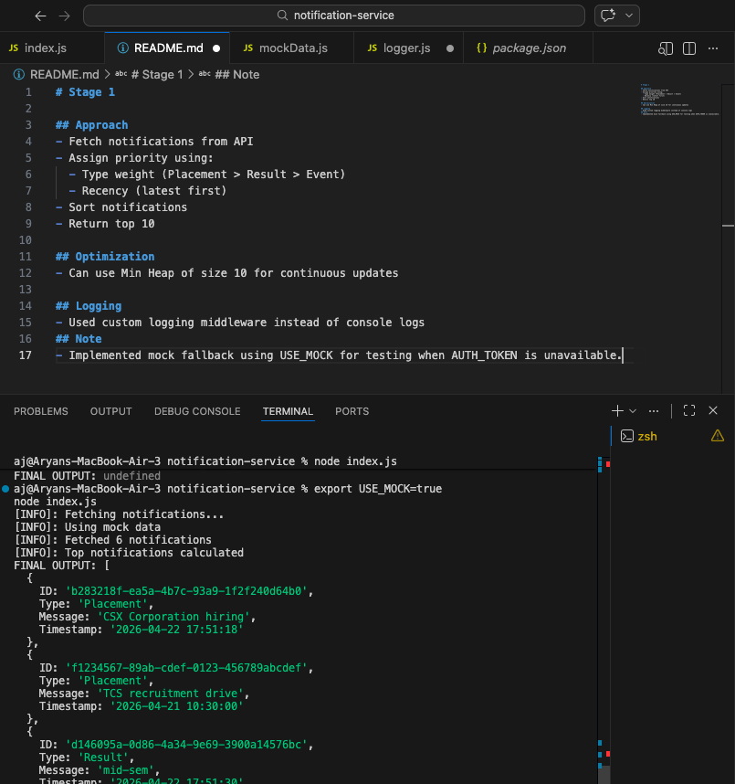
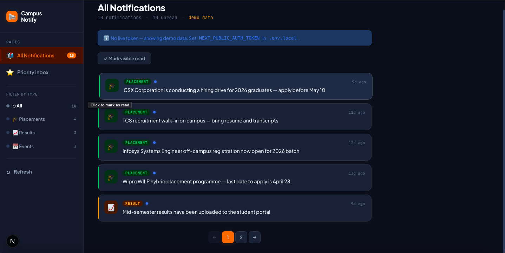

# Stage 1

## Problem Statement

The campus notification platform receives a high volume of notifications across three types: **Placements**, **Results**, and **Events**. Students were losing track of the most important ones. The goal is to implement a **Priority Inbox** that always surfaces the top `n` most important unread notifications first.

---

## Approach

### Priority Scoring

Priority is determined by two factors combined:

1. **Type Weight** (primary sort key)

   | Type      | Weight |
   |-----------|--------|
   | Placement | 3      |
   | Result    | 2      |
   | Event     | 1      |

   Placements are highest priority — they are time-sensitive career opportunities. Results are next (academic impact). Events are the lowest (informational/social).

2. **Recency** (secondary sort key — tiebreaker)

   When two notifications share the same type weight, the more recent one (by `Timestamp`) is ranked higher. This ensures fresh information always floats to the top within a tier.

### Algorithm

```
sort(notifications, key = (TYPE_WEIGHT[b.Type] - TYPE_WEIGHT[a.Type]) || (b.Timestamp - a.Timestamp))
return sorted.slice(0, n)
```

This is a single-pass stable sort — **O(N log N)** time complexity, **O(N)** space.

---

## Maintaining Top-N as New Notifications Arrive

As new notifications keep coming in, we need an efficient strategy to avoid re-sorting the entire list every time.

### Solution: Min-Heap of size N

- Maintain a **min-heap** of size `n`, keyed on `(type_weight, timestamp)`.
- For each incoming notification:
  - If heap size < n → push directly.
  - If the new notification has **higher priority** than the heap's minimum → pop min, push new.
  - Otherwise → discard.
- Result: always O(log n) insertion, O(1) read of top-n.

This ensures **constant memory usage** (capped at `n` entries) and **efficient live updates** regardless of how many new notifications stream in.

---

## Implementation Details

- **Language**: JavaScript (Node.js)
- **File**: `index.js`
- **Auth**: Bearer token via `AUTH_TOKEN` environment variable
- **Fallback**: `USE_MOCK=true` uses local `mockData.js` when the live API is unavailable
- **Logging**: Custom middleware (`logger.js`) replaces raw `console.log` with tagged `[INFO]` / `[ERROR]` output

---

## Output

Running with mock data (`USE_MOCK=true node index.js`) returns the top 10 notifications sorted by priority:

```
[INFO]: Fetching notifications...
[INFO]: Using mock data
[INFO]: Fetched 6 notifications
[INFO]: Top notifications calculated
FINAL OUTPUT: [
  { ID: 'b283218f...', Type: 'Placement', Message: 'CSX Corporation hiring',  Timestamp: '2026-04-22 17:51:18' },
  { ID: 'f1234567...', Type: 'Placement', Message: 'TCS recruitment drive',   Timestamp: '2026-04-21 10:30:00' },
  { ID: 'd146095a...', Type: 'Result',    Message: 'mid-sem',                 Timestamp: '2026-04-22 17:51:30' },
  ...
]
```

Screenshot of actual output → `output.png`



---

# Stage 2

## Overview

A responsive **React/Next.js** frontend for the Campus Notification platform. Displays all notifications with filtering and pagination, and a dedicated **Priority Inbox** that surfaces the top-N most important notifications first.

Live at: **http://localhost:3000** (run `npm run dev` inside `notification-ui/`)

## Project Structure

```
notification-ui/
├── app/
│   ├── layout.tsx          # Root layout — Plus Jakarta Sans font, metadata
│   ├── globals.css         # Full custom dark theme (CSS variables, no framework)
│   ├── page.js             # All Notifications page
│   └── priority/
│       └── page.js         # Priority Inbox page
│
├── components/
│   ├── NotificationCard.js # Individual notification card (read/unread state)
│   ├── Filter.js           # Sidebar type filter (All / Placement / Result / Event)
│   └── Pagination.js       # Custom prev/next paginator
│
└── utils/
    ├── helpers.js          # Priority ranking, time formatter, localStorage helpers
    └── logger.js           # Frontend logging middleware (mirrors backend logger.js)
```

## Features

| Feature | Implementation |
|---|---|
| **All Notifications page** | `/` — full list, filterable by type, paginated (5/page) |
| **Priority Inbox page** | `/priority` — top-N sorted by weight + recency, adjustable slider |
| **Filter by type** | Sidebar filter: All / Placement / Result / Event with counts |
| **Pagination** | Custom prev/next pager, resets on filter change |
| **Read / Unread** | Click card to mark read; pulsing dot = unread; greyed out = read; persisted to `localStorage` |
| **Priority ranking** | Placement (3) > Result (2) > Event (1) + recency tiebreaker |
| **Rank badges** | #1, #2, #3 badges on top cards in Priority Inbox |
| **Top-N slider** | Sidebar range slider (5–20) to adjust how many priority items show |
| **API query params** | Passes `?limit=&notification_type=` to the evaluation-service API |
| **Auth header** | `Authorization: Bearer <token>` via `NEXT_PUBLIC_AUTH_TOKEN` in `.env.local` |
| **Mock fallback** | Falls back to local dataset if API is unreachable — UI always renders |
| **Loading state** | CSS spinner during fetch |
| **Error state** | Info banner when running on mock data |
| **Logging** | Every fetch, filter, mark-read and pagination event logged via `utils/logger.js` |
| **Responsive** | Sidebar collapses to horizontal row on mobile |

## Tech Stack

- **Framework**: Next.js 16 (App Router)
- **Styling**: Custom CSS only (`globals.css`) — no Tailwind, no MUI
- **Font**: Plus Jakarta Sans (Google Fonts)
- **State**: React `useState` / `useEffect` / `useCallback`
- **Persistence**: `localStorage` for read/unread tracking
- **Logging**: Custom `utils/logger.js` middleware — `[INFO]` / `[WARN]` / `[ERROR]` / `[DEBUG]`

## Setup & Run

```bash
cd notification-ui
npm install
npm run dev          # starts on http://localhost:3000
```

To connect the live evaluation API, add your token to `notification-ui/.env.local`:

```
NEXT_PUBLIC_AUTH_TOKEN=your_bearer_token_here
```

Without a token the app falls back to the built-in mock dataset automatically.

## API Integration

```
GET http://20.207.122.201/evaluation-service/notifications
    ?limit=100
    &notification_type=Placement   ← optional, for type filter
    Authorization: Bearer <token>
```

Supported `notification_type` values: `Placement`, `Result`, `Event`

## Screenshot


